# System Architecture Diagrams

Visual representations of the chat application architecture, data flow, and component relationships.

---

## 1. High-Level System Architecture

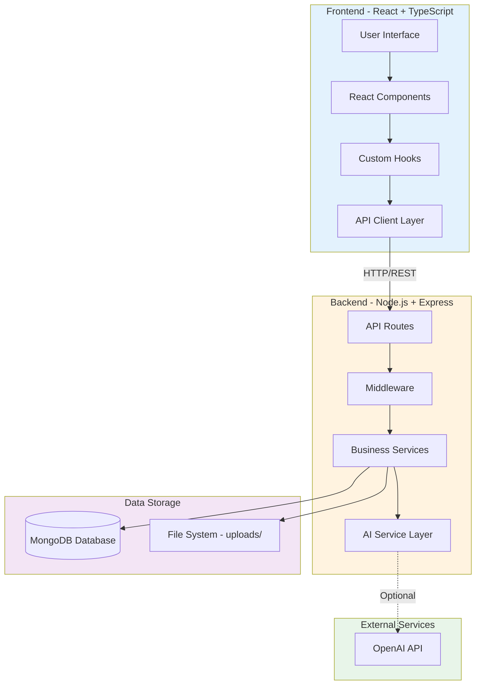

---

## 2. Application Layer Architecture

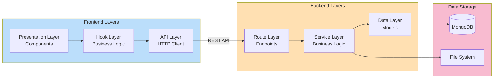

---

## 3. Component Hierarchy

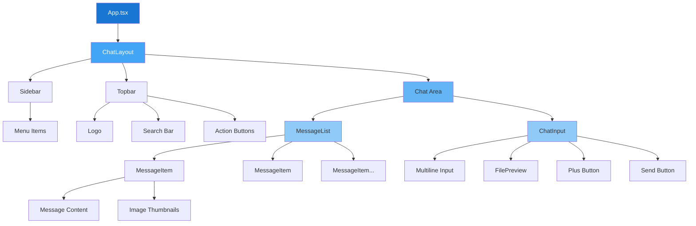

---

## 4. Data Flow - Send Message

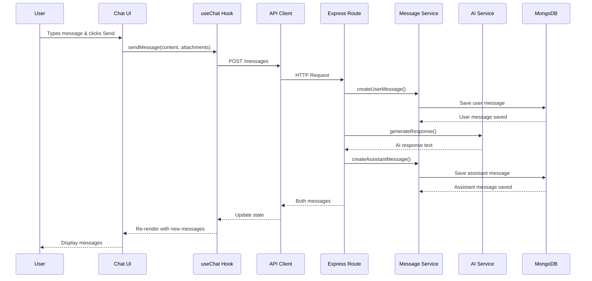

---

## 5. Data Flow - File Upload

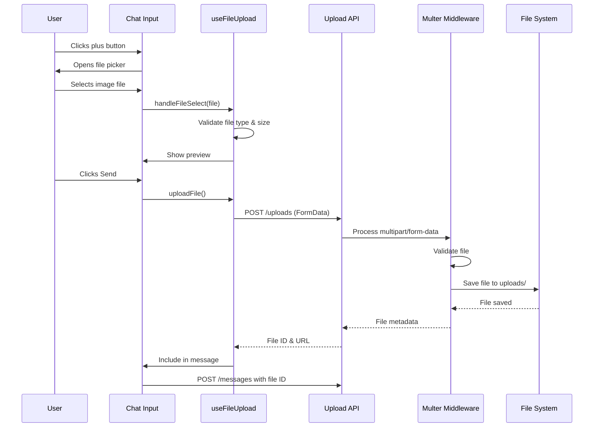

---

## 6. Database Schema Relationships

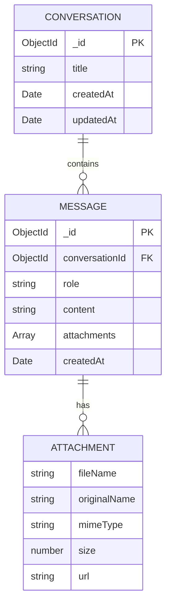

---

## 7. API Endpoint Structure

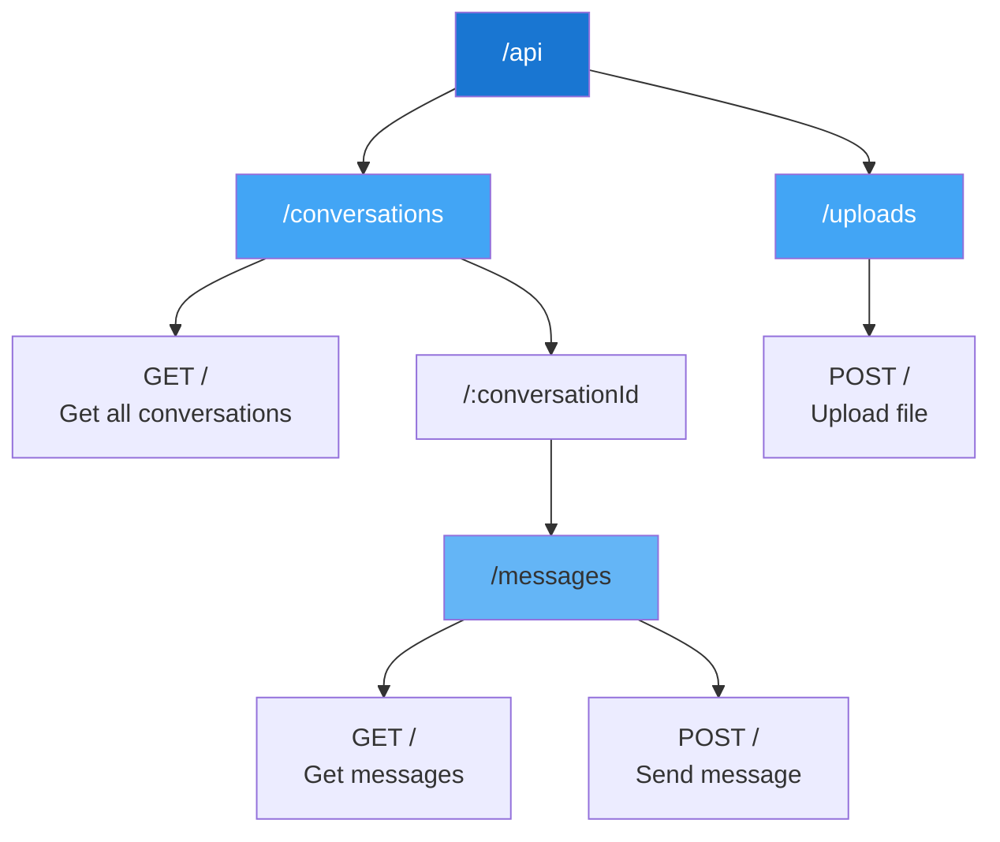

---

## 8. AI Service Architecture

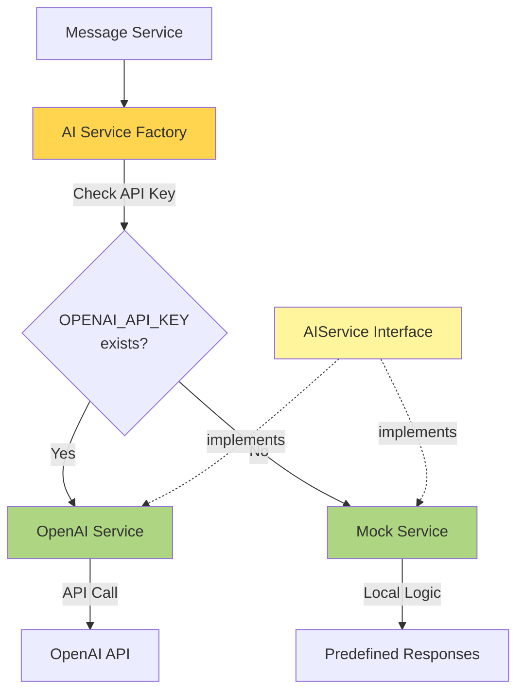

---

## 9. Frontend State Management

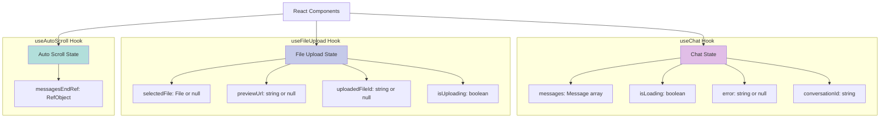

---

## 10. Request/Response Flow

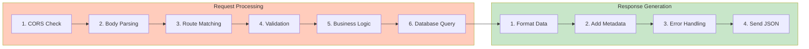

---

## 11. File Upload Flow Diagram

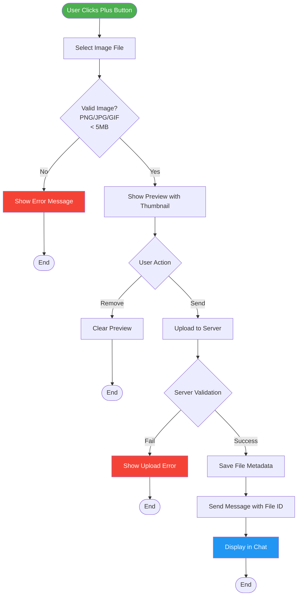

---

## 12. Message Creation Flow

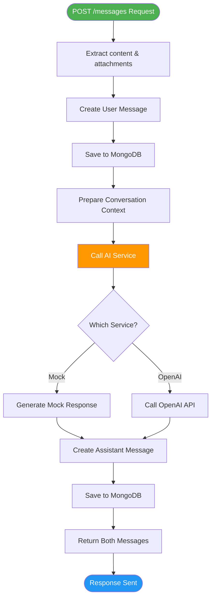

---

## 13. Component Communication Pattern

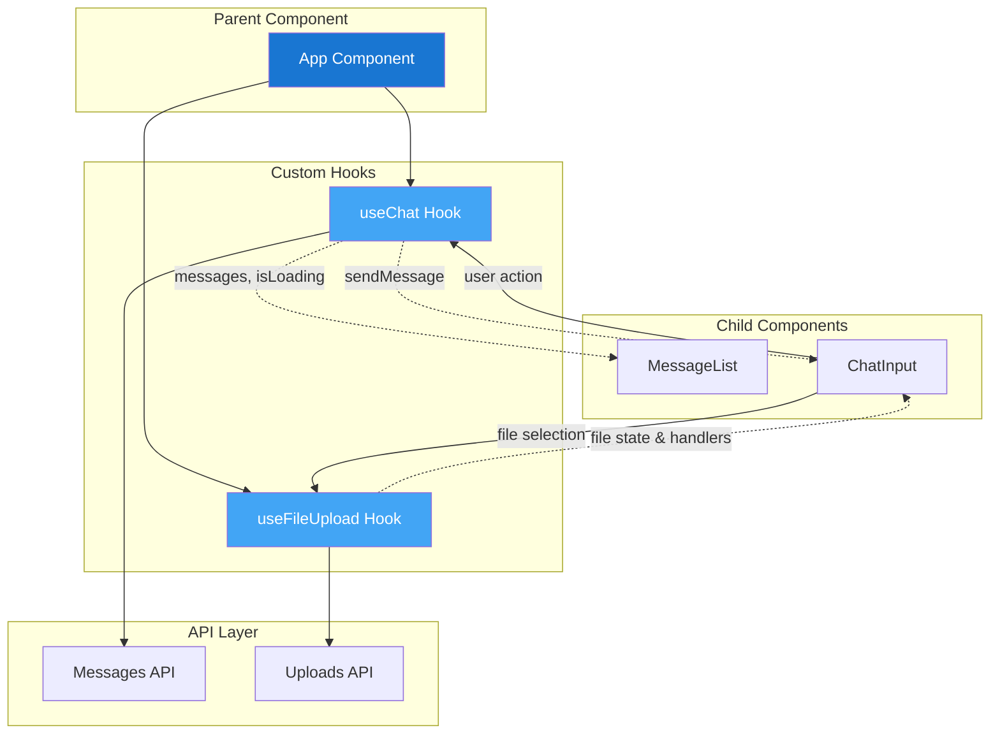

---

## 14. Error Handling Flow

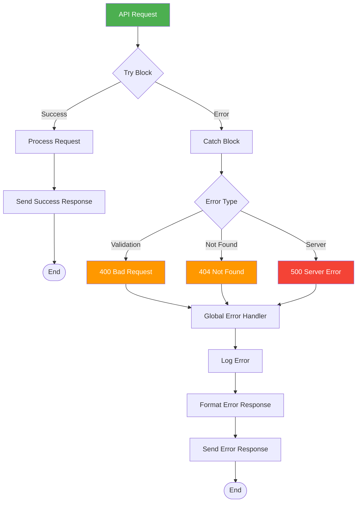

---

## 15. Deployment Architecture

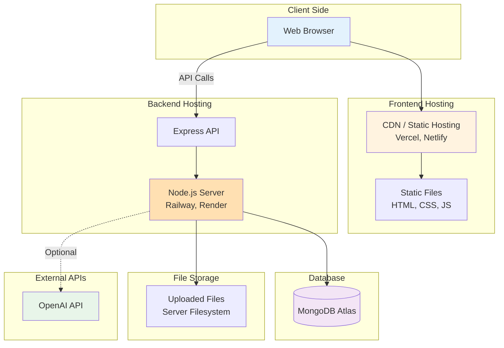

---

## Diagram Explanations

### High-Level System Architecture

Shows the three main layers: Frontend (React), Backend (Express), and Storage (MongoDB + File System), plus optional external AI service integration.

### Application Layer Architecture

Illustrates the separation of concerns with distinct layers for presentation, business logic, API communication, and data access.

### Component Hierarchy

Visual representation of how React components are nested and organized, from the root App component down to individual UI elements.

### Data Flow - Send Message

Sequence diagram showing the complete flow when a user sends a message, including AI response generation and database persistence.

### Data Flow - File Upload

Detailed sequence of events when a user uploads an image file, from selection through validation to storage.

### Database Schema Relationships

Entity-relationship diagram showing how Conversations, Messages, and Attachments are related in MongoDB.

### API Endpoint Structure

Tree structure of all REST API endpoints and their HTTP methods.

### AI Service Architecture

Shows the factory pattern used for AI service selection and the two implementations (Mock and OpenAI).

### Frontend State Management

Breakdown of state managed by custom React hooks and how components consume this state.

### Request/Response Flow

Step-by-step processing of HTTP requests and response generation in the Express backend.

### File Upload Flow Diagram

Decision tree showing all possible paths during file upload, including validation and error handling.

### Message Creation Flow

Detailed flowchart of the message creation process, including AI response generation.

### Component Communication Pattern

Shows how data flows between parent components, custom hooks, child components, and the API layer.

### Error Handling Flow

Illustrates how different types of errors are caught, categorized, and handled throughout the application.

### Deployment Architecture

Production deployment setup showing how different parts of the application are hosted and connected.

---

These diagrams provide a comprehensive visual guide to understanding the chat application's architecture, data flow, and component relationships. Use them as reference during implementation and for onboarding new developers.
